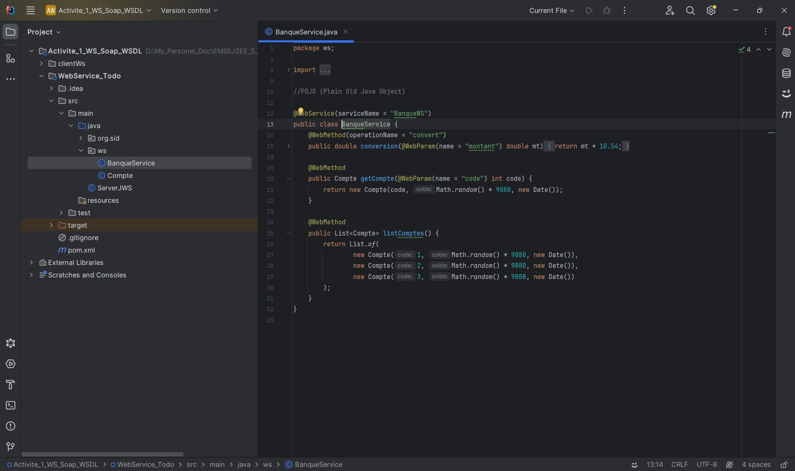
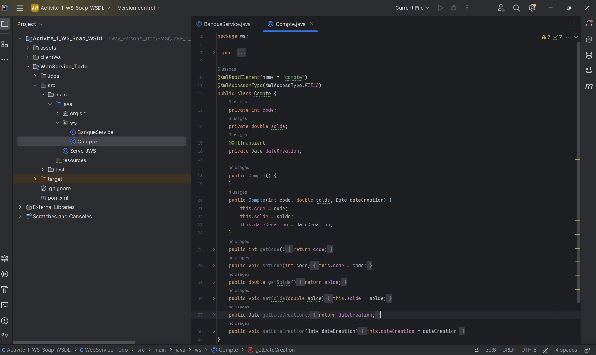
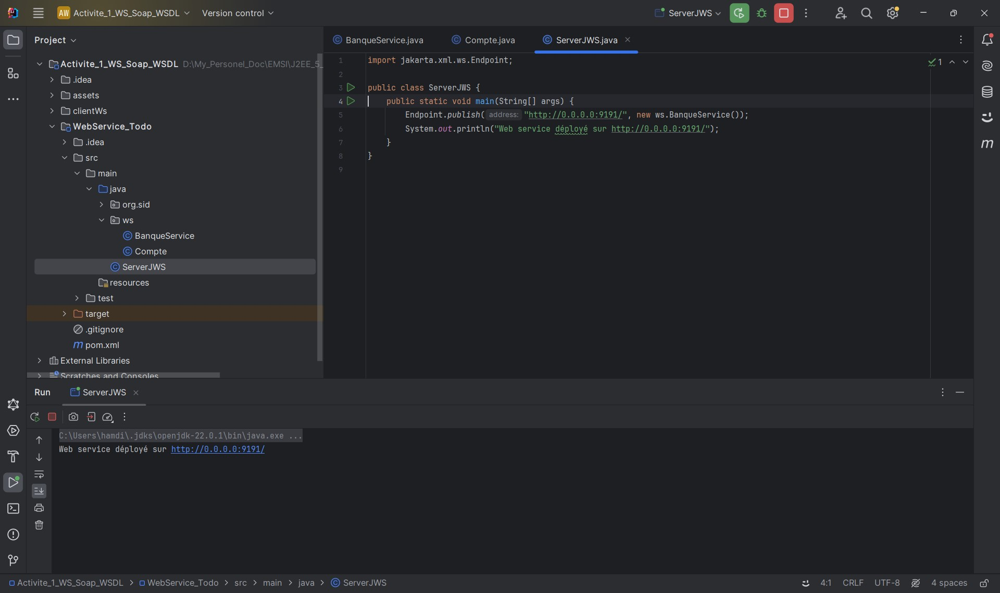
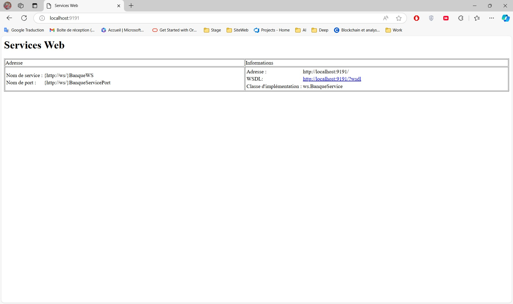
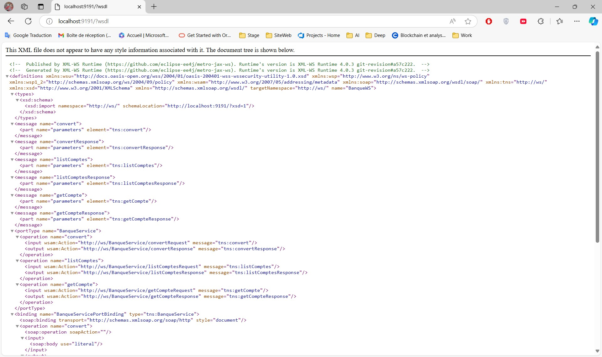
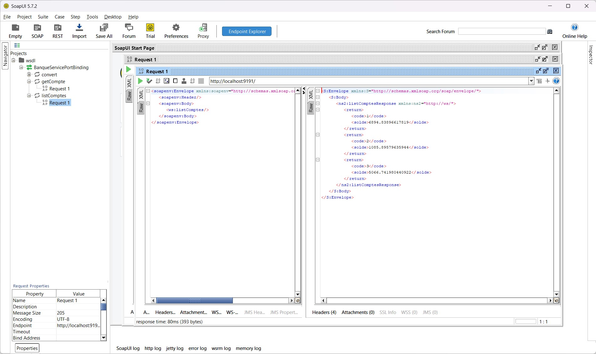
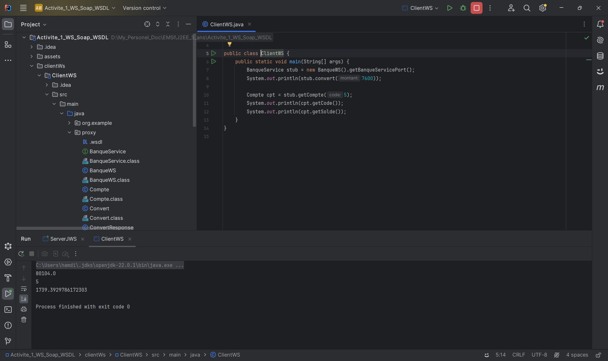

<h2>Activité Pratique N°1 - Web services SOAP WSDL</h2>

<h3>Web Service "BanqueService" :</h3>

<h3>Web Service "Compte" :</h3>

<h3>Classe principale du Web Service 'ServerJWS' avec lien de déploiement" :</h3>

<h3>Affichage dans le navigateur : Web Service "ServerJWS" :</h3>

<h3>Affichage dans le navigateur : Web Service "ServerJWS" avec "wsdl" :</h3>

<h3>Test avec SoapUI : Web Service 'ServerJWS' :</h3>

<h3>Exécution dans le nouveau projet "ClientWS" :</h3>
